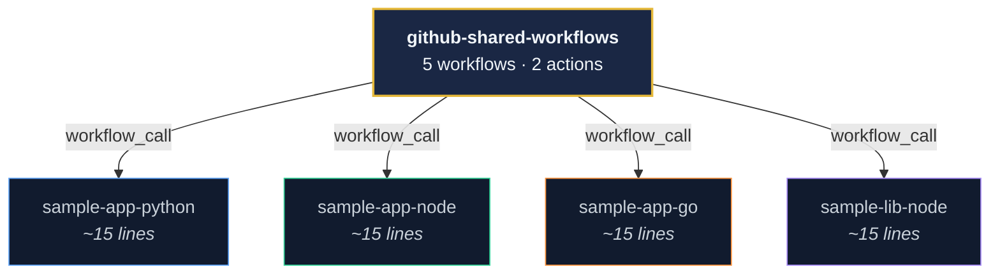

# Executive Summary

## Overview

This project is a **fully working centralized CI/CD platform** built on GitHub Actions — reusable workflows and composite actions that any repository can adopt with minimal configuration (~15 lines of YAML). It demonstrates practical, hands-on expertise in designing and implementing production-grade GHA pipelines.

## Components at a Glance

| Component | What It Does | Status |
|---|---|---|
| **5 Reusable Workflows** | CI, Matrix CI, Integration CI, Publish, Release | ✅ Implemented |
| **2 Composite Actions** | Toolchain Setup (Python/Node/Go + caching), Slack Notify | ✅ Implemented |
| **4 Consumer Repos** | Python app, Node app, Go app, Node library — all using shared workflows | ✅ Integrated |
| **Live Dashboard** | GitHub Pages dashboard with cross-repo workflow status, health metrics | ✅ Deployed |
| **Slack Integration** | Color-coded notifications for CI events, failures, and releases | ✅ Configured |

## What Reusable Workflows Enable

Reusable workflows (`workflow_call`) let a central repository own CI/CD logic. Consumer repos call these workflows with just inputs and secrets — exactly like calling a function from a shared library. This project demonstrates how that works across three languages and four repositories.

### Capabilities Demonstrated

| Capability | Detail |
|---|---|
| **Centralized CI/CD** | CI/CD logic maintained in one place, consumed by any repo |
| **Consistent Pipelines** | All repos follow the same lint → test → scan → notify pipeline |
| **Rapid Onboarding** | New repos get full CI/CD with ~15 lines of YAML |
| **Security Scanning** | Trivy vulnerability scanning across all repos automatically |
| **Cross-Repo Visibility** | Live dashboard shows health of all repos in one view |
| **Governed Changes** | Changes to CI/CD flow are reviewed via PR in the central repo |

## Languages & Ecosystems Supported

| Language | Runtime Setup | Dependency Caching | Linting | Testing | Security Scan |
|---|---|---|---|---|---|
| **Python** | `actions/setup-python` | pip cache | flake8 | pytest | Trivy |
| **Node.js** | `actions/setup-node` | npm cache | ESLint | Jest | Trivy |
| **Go** | `actions/setup-go` | Go module cache | golangci-lint | go test | Trivy |

## Workflow Catalog

| Workflow | Key Capabilities | Consumer Repos Using It |
|---|---|---|
| `reusable-ci.yml` | Lint → Test → Security Scan → Slack | sample-app-python, sample-app-node, sample-app-go |
| `reusable-matrix-ci.yml` | N versions × M OSes × K test types (parallel) | sample-lib-node |
| `reusable-integration-ci.yml` | Service containers (PostgreSQL, Redis), Docker build, staged deploy | sample-app-python |
| `reusable-publish.yml` | Build → Staging (@next) → Production (@latest) with approval gates | sample-lib-node |
| `reusable-release.yml` | Semantic versioning, changelog, GitHub Releases | sample-app-python, sample-app-node |

## Expertise Demonstrated

1. **Reusable workflow design** — parameterized workflows with typed inputs, secrets passthrough, and conditional steps
2. **Multi-language support** — single workflow handles Python, Node.js, and Go via conditional logic
3. **Advanced CI patterns** — dynamic matrix builds, service containers, parallel test stages
4. **Production deployment patterns** — environment approval gates, Docker build & push
5. **Observability** — Slack notifications, live dashboard, CI summaries
6. **Breadth of GHA coverage** — from basic CI to advanced deployment patterns, demonstrating readiness for any GHA task
