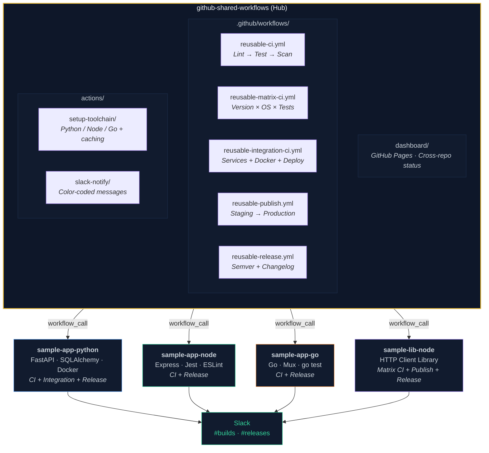
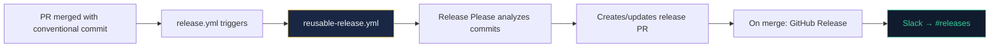
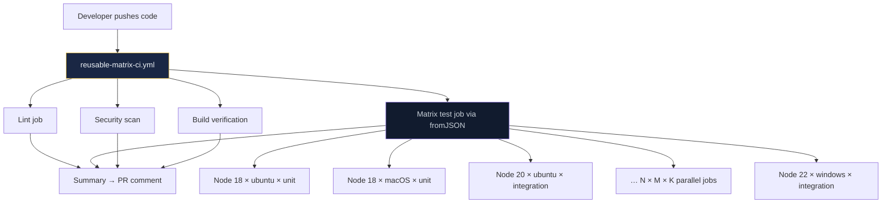
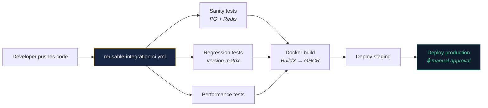
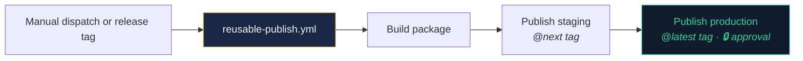

# Architecture

## System Overview

The platform follows a **hub-and-spoke** architecture. The central `github-shared-workflows` repository is the hub, containing all reusable workflows, composite actions, and the live dashboard. Consumer repositories (the spokes) call these workflows using GitHub's native `workflow_call` trigger.

## Architecture Diagram



## Repository Structure

```
github-shared-workflows/
├── .github/
│   ├── workflows/
│   │   ├── reusable-ci.yml              # Standard CI pipeline
│   │   ├── reusable-matrix-ci.yml       # Matrix CI (multi-version × OS × test type)
│   │   ├── reusable-integration-ci.yml  # Services + Docker + Deploy
│   │   ├── reusable-publish.yml         # Package publishing with env gates
│   │   ├── reusable-release.yml         # Semantic release pipeline
│   │   └── update-dashboard.yml         # Dashboard data updater (scheduled)
│   └── dependabot.yml                   # Automated dependency updates
├── actions/
│   ├── setup-toolchain/action.yml       # Composite: Python/Node/Go + caching
│   └── slack-notify/action.yml          # Composite: Slack notifications
├── dashboard/                           # GitHub Pages dashboard
│   ├── index.html
│   ├── style.css
│   ├── app.js
│   └── data/                            # Pre-generated static JSON data
└── docs/
    ├── ARCHITECTURE.md
    └── USAGE.md
```

## Design Principles

### 1. Reusable Workflows vs Composite Actions

We use **both**, each for its ideal purpose:

| Type | Use Case | Example |
|---|---|---|
| **Reusable Workflow** (`workflow_call`) | Full CI/CD pipelines with multiple jobs | `reusable-ci.yml`, `reusable-publish.yml` |
| **Composite Action** (`uses: ./actions/...`) | Atomic, reusable steps within a job | `setup-toolchain`, `slack-notify` |

**Why?** Reusable workflows run on their own runners with full `jobs` context, secret forwarding, and conditional job execution. Composite actions are lightweight steps that run within an existing job.

### 2. Public Repository

The central repo is **public** because GitHub requires callers to have access to the workflow file. For enterprise use, **internal** (same org) or **private** (GitHub Enterprise) visibility would be used instead.

### 3. Zero-Dependency Dashboard

The live dashboard uses **vanilla HTML/CSS/JS** — no framework, no build tools, no bundler. This means:
- GitHub Pages hosts it directly
- Anyone can read and modify the code
- Zero maintenance burden from dependency updates

### 4. Static Data over Live API

The dashboard uses **pre-generated static JSON** instead of live GitHub API calls. A scheduled workflow refreshes the data every 6 hours. This eliminates API rate-limiting for visitors and ensures the dashboard always loads fast.

## Data Flow Diagrams

### CI Pipeline Flow


### Release Flow



### Matrix CI Flow



### Integration CI Flow



### Publish Flow



## Security Considerations

| Aspect | Implementation |
|---|---|
| **Dependency scanning** | Trivy filesystem scan on every CI run |
| **Secret management** | GitHub Secrets with `secrets:` passthrough (never exposed in logs) |
| **Dependency updates** | Dependabot configured for automated PR-based updates |
| **Immutable logs** | GitHub-hosted, tamper-proof audit trail |
| **Scoped tokens** | `GITHUB_TOKEN` auto-scoped per-job with minimal permissions |
