# Architecture

## System Overview

The platform follows a **hub-and-spoke** architecture. The central `github-shared-workflows` repository is the hub, containing all reusable workflows, composite actions, and the live dashboard. Consumer repositories (the spokes) call these workflows using GitHub's native `workflow_call` trigger.

## Architecture Diagram

```mermaid
graph TB
    subgraph HUB["github-shared-workflows (Hub)"]
        direction TB
        subgraph WF[".github/workflows/"]
            W1["reusable-ci.yml<br/><em>Lint → Test → Scan</em>"]
            W2["reusable-matrix-ci.yml<br/><em>Version × OS × Tests</em>"]
            W3["reusable-integration-ci.yml<br/><em>Services + Docker + Deploy</em>"]
            W4["reusable-publish.yml<br/><em>Staging → Production</em>"]
            W5["reusable-release.yml<br/><em>Semver + Changelog</em>"]
        end
        subgraph ACT["actions/"]
            A1["setup-toolchain/<br/><em>Python / Node / Go + caching</em>"]
            A2["slack-notify/<br/><em>Color-coded messages</em>"]
        end
        DASH["dashboard/<br/><em>GitHub Pages · Cross-repo status</em>"]
    end

    HUB -->|workflow_call| P["<strong>sample-app-python</strong><br/>FastAPI · SQLAlchemy · Docker<br/><em>CI + Integration + Release</em>"]
    HUB -->|workflow_call| N["<strong>sample-app-node</strong><br/>Express · Jest · ESLint<br/><em>CI + Release</em>"]
    HUB -->|workflow_call| G["<strong>sample-app-go</strong><br/>Go · Mux · go test<br/><em>CI + Release</em>"]
    HUB -->|workflow_call| L["<strong>sample-lib-node</strong><br/>HTTP Client Library<br/><em>Matrix CI + Publish + Release</em>"]

    P & N & G & L --> S["Slack<br/>#builds · #releases"]

    style HUB fill:#0e1729,stroke:#e5b83a,stroke-width:2px,color:#f0f4f8
    style WF fill:#111b2e,stroke:#1c2d4a,color:#c9d1d9
    style ACT fill:#111b2e,stroke:#1c2d4a,color:#c9d1d9
    style DASH fill:#111b2e,stroke:#1c2d4a,color:#c9d1d9
    style P fill:#111b2e,stroke:#60a5fa,color:#c9d1d9
    style N fill:#111b2e,stroke:#34d399,color:#c9d1d9
    style G fill:#111b2e,stroke:#fb923c,color:#c9d1d9
    style L fill:#111b2e,stroke:#a78bfa,color:#c9d1d9
    style S fill:#111b2e,stroke:#34d399,color:#34d399
```



## Repository Structure

```
github-shared-workflows/
├── .github/
│   ├── workflows/
│   │   ├── reusable-ci.yml              # Standard CI pipeline
│   │   ├── reusable-matrix-ci.yml       # Matrix CI (multi-version × OS × test type)
│   │   ├── reusable-integration-ci.yml  # Services + Docker + Deploy
│   │   ├── reusable-publish.yml         # Package publishing with env gates
│   │   ├── reusable-release.yml         # Semantic release pipeline
│   │   └── update-dashboard.yml         # Dashboard data updater (scheduled)
│   └── dependabot.yml                   # Automated dependency updates
├── actions/
│   ├── setup-toolchain/action.yml       # Composite: Python/Node/Go + caching
│   └── slack-notify/action.yml          # Composite: Slack notifications
├── dashboard/                           # GitHub Pages dashboard
│   ├── index.html
│   ├── style.css
│   ├── app.js
│   └── data/                            # Pre-generated static JSON data
└── docs/
    ├── ARCHITECTURE.md
    └── USAGE.md
```

## Design Principles

### 1. Reusable Workflows vs Composite Actions

We use **both**, each for its ideal purpose:

| Type | Use Case | Example |
|---|---|---|
| **Reusable Workflow** (`workflow_call`) | Full CI/CD pipelines with multiple jobs | `reusable-ci.yml`, `reusable-publish.yml` |
| **Composite Action** (`uses: ./actions/...`) | Atomic, reusable steps within a job | `setup-toolchain`, `slack-notify` |

**Why?** Reusable workflows run on their own runners with full `jobs` context, secret forwarding, and conditional job execution. Composite actions are lightweight steps that run within an existing job.

### 2. Public Repository

The central repo is **public** because GitHub requires callers to have access to the workflow file. For enterprise use, **internal** (same org) or **private** (GitHub Enterprise) visibility would be used instead.

### 3. Zero-Dependency Dashboard

The live dashboard uses **vanilla HTML/CSS/JS** — no framework, no build tools, no bundler. This means:
- GitHub Pages hosts it directly
- Anyone can read and modify the code
- Zero maintenance burden from dependency updates

### 4. Static Data over Live API

The dashboard uses **pre-generated static JSON** instead of live GitHub API calls. A scheduled workflow refreshes the data every 6 hours. This eliminates API rate-limiting for visitors and ensures the dashboard always loads fast.

## Data Flow Diagrams

### CI Pipeline Flow


### Release Flow


### Matrix CI Flow

```mermaid
flowchart TB
    A["Developer pushes code"] --> B["reusable-matrix-ci.yml"]
    B --> C["Lint job"]
    B --> D["Matrix test job via fromJSON"]
    B --> E["Security scan"]
    B --> F["Build verification"]
    D --> D1["Node 18 × ubuntu × unit"]
    D --> D2["Node 18 × macOS × unit"]
    D --> D3["Node 20 × ubuntu × integration"]
    D --> D4["… N × M × K parallel jobs"]
    D --> D5["Node 22 × windows × integration"]
    C & D & E & F --> G["Summary → PR comment"]

    style B fill:#1a2744,stroke:#e5b83a,color:#f0f4f8
    style D fill:#111b2e,stroke:#a78bfa,color:#c9d1d9
```



### Integration CI Flow


### Publish Flow


## Security Considerations

| Aspect | Implementation |
|---|---|
| **Dependency scanning** | Trivy filesystem scan on every CI run |
| **Secret management** | GitHub Secrets with `secrets:` passthrough (never exposed in logs) |
| **Dependency updates** | Dependabot configured for automated PR-based updates |
| **Immutable logs** | GitHub-hosted, tamper-proof audit trail |
| **Scoped tokens** | `GITHUB_TOKEN` auto-scoped per-job with minimal permissions |
