# Reusable Workflows Reference

This document provides a detailed reference for each reusable workflow in the `github-shared-workflows` repository.

---

## 1. `reusable-ci.yml` — Standard CI Pipeline

**Purpose:** Provides a complete lint → test → security scan pipeline for Python, Node.js, and Go projects.

**Trigger:** `workflow_call` (called by consumer repos)

### Inputs

| Input | Type | Required | Default | Description |
|---|---|---|---|---|
| `language` | string | Yes | — | `python`, `node`, or `go` |
| `language_version` | string | Yes | — | e.g., `3.11`, `20`, `1.24` |
| `working_directory` | string | No | `.` | Path to source code |
| `enable_lint` | boolean | No | `true` | Run linting job |
| `enable_test` | boolean | No | `true` | Run test suite |
| `enable_security_scan` | boolean | No | `true` | Run Trivy vulnerability scan |
| `coverage_threshold` | number | No | `80` | Minimum code coverage % |

### Secrets

| Secret | Required | Description |
|---|---|---|
| `SLACK_WEBHOOK_URL` | No | Slack webhook for CI notifications |

### Jobs

```mermaid
flowchart LR
    L["**Lint**<br/>flake8 · ESLint<br/>golangci-lint"]
    T["**Test**<br/>pytest · jest<br/>go test"]
    S["**Security Scan**<br/>Trivy · SAST<br/>audit"]
    R["**Summary**<br/>PR comment"]

    L & T & S --> R

    style L fill:#1a2744,stroke:#e5b83a,color:#f0f4f8
    style T fill:#1a2744,stroke:#e5b83a,color:#f0f4f8
    style S fill:#1a2744,stroke:#e5b83a,color:#f0f4f8
    style R fill:#111b2e,stroke:#34d399,color:#34d399
```



### Usage Example

```yaml
jobs:
  ci:
    uses: mruthyunjaya-lakkappanavar/github-shared-workflows/.github/workflows/reusable-ci.yml@main
    with:
      language: python
      language_version: "3.11"
      enable_lint: true
      enable_test: true
      enable_security_scan: true
    secrets:
      SLACK_WEBHOOK_URL: ${{ secrets.SLACK_WEBHOOK_URL }}
```

### What Happens Per Language

| Step | Python | Node.js | Go |
|---|---|---|---|
| Setup | `actions/setup-python@v5` | `actions/setup-node@v4` | `actions/setup-go@v5` |
| Dependencies | `pip install -r requirements.txt` | `npm ci` | `go mod download` |
| Lint | `flake8 --max-complexity=10` | `eslint --max-warnings=0` | `golangci-lint run` |
| Test | `pytest --cov --junitxml` | `jest --coverage` | `go test -v -coverprofile` |
| Security | `trivy fs --severity HIGH,CRITICAL` | `trivy fs` + `npm audit` | `trivy fs` + `govulncheck` |

---

## 2. `reusable-matrix-ci.yml` — Matrix CI

**Purpose:** Runs tests across multiple language versions, operating systems, and test types in parallel. Ideal for libraries that need cross-platform/cross-version compatibility verification.

**Trigger:** `workflow_call`

### Inputs

| Input | Type | Required | Default | Description |
|---|---|---|---|---|
| `language` | string | Yes | — | `python`, `node`, or `go` |
| `language_versions` | string | Yes | — | JSON array: `'["18", "20", "22"]'` |
| `os_matrix` | string | No | `'["ubuntu-latest"]'` | JSON array of OS runners |
| `test_types` | string | No | `'["unit"]'` | JSON array of test categories |
| `fail_fast` | boolean | No | `false` | Stop all matrix jobs if one fails |
| `coverage_threshold` | number | No | `80` | Minimum coverage % |
| `enable_build` | boolean | No | `false` | Run build verification |
| `build_script` | string | No | `""` | Build command |
| `enable_lint` | boolean | No | `true` | Run linting |
| `enable_security` | boolean | No | `true` | Run security scan |

### How the Matrix Works

The workflow uses `fromJSON()` to dynamically expand matrix axes from input strings:

```yaml
strategy:
  fail-fast: ${{ inputs.fail_fast }}
  matrix:
    version: ${{ fromJSON(inputs.language_versions) }}
    os: ${{ fromJSON(inputs.os_matrix) }}
    test_type: ${{ fromJSON(inputs.test_types) }}
```

Example expansion for `sample-lib-node`:
- 3 Node versions (18, 20, 22) × 3 OSes (Ubuntu, macOS, Windows) × 2 test types (unit, integration)
- = **18 parallel jobs**

### Usage Example

```yaml
jobs:
  ci:
    uses: mruthyunjaya-lakkappanavar/github-shared-workflows/.github/workflows/reusable-matrix-ci.yml@main
    with:
      language: node
      language_versions: '["18", "20", "22"]'
      os_matrix: '["ubuntu-latest", "macos-latest", "windows-latest"]'
      test_types: '["unit", "integration"]'
      fail_fast: false
      enable_build: true
      build_script: "npm run build"
    secrets:
      SLACK_WEBHOOK_URL: ${{ secrets.SLACK_WEBHOOK_URL }}
```

---

## 3. `reusable-integration-ci.yml` — Integration CI

**Purpose:** Full integration pipeline with database service containers, parallel test stages, Docker image building, and staged deployment with approval gates.

**Trigger:** `workflow_call`

### Inputs

| Input | Type | Required | Default | Description |
|---|---|---|---|---|
| `language` | string | Yes | — | `python`, `node`, or `go` |
| `language_version` | string | Yes | — | Primary language version |
| `language_versions` | string | No | `""` | JSON array for regression matrix |
| `enable_sanity` | boolean | No | `true` | Run smoke/sanity tests |
| `enable_regression` | boolean | No | `true` | Run full regression suite |
| `enable_performance` | boolean | No | `false` | Run performance tests |
| `enable_docker_build` | boolean | No | `false` | Build & push Docker image |
| `docker_image_name` | string | No | `""` | Image name in registry |
| `docker_registry` | string | No | `ghcr.io` | Container registry |
| `enable_deploy_staging` | boolean | No | `false` | Deploy to staging |
| `enable_deploy_production` | boolean | No | `false` | Deploy to production (manual approval) |

### Job Graph


### Service Containers

The sanity test job automatically provisions **PostgreSQL 16** and **Redis 7** as service containers:

```yaml
services:
  postgres:
    image: postgres:16
    env:
      POSTGRES_USER: testuser
      POSTGRES_PASSWORD: testpass
      POSTGRES_DB: testdb
    ports: ["5432:5432"]
    options: --health-cmd pg_isready --health-interval 10s
  redis:
    image: redis:7-alpine
    ports: ["6379:6379"]
    options: --health-cmd "redis-cli ping"
```

### Usage Example

```yaml
jobs:
  integration:
    uses: mruthyunjaya-lakkappanavar/github-shared-workflows/.github/workflows/reusable-integration-ci.yml@main
    with:
      language: python
      language_version: "3.12"
      language_versions: '["3.11", "3.12", "3.13"]'
      enable_sanity: true
      enable_regression: true
      enable_performance: true
      enable_docker_build: true
      docker_image_name: "sample-app-python"
    secrets:
      SLACK_WEBHOOK_URL: ${{ secrets.SLACK_WEBHOOK_URL }}
```

---

## 4. `reusable-publish.yml` — Package Publishing

**Purpose:** Publishes packages to npm, GitHub Packages, or PyPI with a staged rollout (staging → production) and environment approval gates.

**Trigger:** `workflow_call`

### Inputs

| Input | Type | Required | Default | Description |
|---|---|---|---|---|
| `language` | string | Yes | — | `node` or `python` |
| `language_version` | string | Yes | — | Language version for build |
| `registry` | string | No | `github` | `npm`, `github`, or `pypi` |
| `publish_staging` | boolean | No | `true` | Publish pre-release (@next) |
| `publish_production` | boolean | No | `true` | Publish release (@latest, requires approval) |
| `build_script` | string | No | `""` | Custom build command |

### Pipeline

```mermaid
flowchart LR
    A["Build Package<br/><em>version · build · artifact</em>"]
    B["Publish Staging<br/><em>@next · test PyPI</em>"]
    C["Publish Production<br/><em>@latest · PyPI · 🔐 approval</em>"]

    A --> B --> C

    style A fill:#1a2744,stroke:#e5b83a,color:#f0f4f8
    style C fill:#111b2e,stroke:#34d399,color:#34d399
```



### Permissions

```yaml
permissions:
  contents: write
  packages: write
  pull-requests: write
  id-token: write
```

### Usage Example

```yaml
jobs:
  publish:
    uses: mruthyunjaya-lakkappanavar/github-shared-workflows/.github/workflows/reusable-publish.yml@main
    with:
      language: node
      language_version: "20"
      registry: github
      publish_staging: true
      publish_production: true
      build_script: "npm run build"
    secrets:
      NPM_TOKEN: ${{ secrets.NPM_TOKEN }}
      SLACK_WEBHOOK_URL: ${{ secrets.SLACK_WEBHOOK_URL }}
```

---

## 5. `reusable-release.yml` — Semantic Release

**Purpose:** Automated semantic versioning, changelog generation, and GitHub Release creation using conventional commits.

**Trigger:** `workflow_call`

### Inputs

| Input | Type | Required | Default | Description |
|---|---|---|---|---|
| `language` | string | Yes | — | `python` or `node` |
| `release_type` | string | No | `auto` | `auto`, `patch`, `minor`, `major` |
| `enable_changelog` | boolean | No | `true` | Auto-generate CHANGELOG.md |
| `enable_slack_notify` | boolean | No | `true` | Slack notification on release |

### How It Works

1. **Conventional commits** drive version bumps:
   - `feat:` → minor release
   - `fix:` → patch release
   - `feat!:` or `BREAKING CHANGE:` → major release
2. **Release Please** (by Google) creates a release PR with version bump + updated changelog
3. On merge of the release PR → GitHub Release is created automatically
4. Slack notification sent to `#releases` channel

### Usage Example

```yaml
jobs:
  release:
    uses: mruthyunjaya-lakkappanavar/github-shared-workflows/.github/workflows/reusable-release.yml@main
    with:
      language: python
      enable_changelog: true
      enable_slack_notify: true
    secrets:
      SLACK_WEBHOOK_URL: ${{ secrets.SLACK_WEBHOOK_URL }}
```
