# Live Dashboard

## Overview

The CI/CD Dashboard is a **single-page web application** hosted on GitHub Pages that provides cross-repo workflow visibility. It displays real-time status of all CI/CD pipelines across all consumer repositories.

**Live URL:** [mruthyunjaya-lakkappanavar.github.io/github-shared-workflows](https://mruthyunjaya-lakkappanavar.github.io/github-shared-workflows/)

---

## Dashboard Sections

### 1. Health Overview

Summary cards showing aggregate metrics:

| Metric | Description |
|---|---|
| **Total Runs** | Number of workflow runs across all repos |
| **Pass Rate** | Percentage of successful runs |
| **Avg Duration** | Average build time |
| **Active Repos** | Number of monitored repositories |
| **Failure Streak** | Current/longest failure streak |

### 2. Repository Pipeline Cards

Per-repo cards with categorized status panels:

| Category | Icon | Matches |
|---|---|---|
| Lint | 🔍 | Jobs matching `lint` |
| Unit Tests | 🧪 | Jobs matching `test` |
| Security | 🛡️ | Jobs matching `security`, `scan`, `trivy` |
| Release | 🚀 | Jobs matching `release` |

Each card shows:
- Latest run status (pass/fail/in-progress)
- Last 5 run history as status dots
- Branch and commit that triggered the run
- Duration and timestamp

### 3. Workflow Timeline

Chronological timeline of recent workflow runs across all repos. Filterable by status (All / Passing / Failing).

### 4. Build Insights

Breakdown charts showing:
- **By Language** — Distribution across Python, Node, Go
- **By Workflow** — CI vs Release vs Publish run counts
- **Top Contributors** — Most active committers
- **By Branch** — Build activity per branch

---

## Technical Architecture

### Zero Dependencies

The dashboard is built with **vanilla HTML + CSS + JavaScript**:
- No React, Vue, or Angular
- No build tools, no bundler, no npm
- Works as static files on GitHub Pages
- Anyone can read and modify the code

### Static Data Strategy

Instead of making live GitHub API calls (which have rate limits of 60 req/hr for unauthenticated users), the dashboard uses **pre-generated static JSON files**.

**Data refresh process:**

```mermaid
flowchart LR
    A["⏰ Scheduled workflow<br/><em>every 6 hours</em>"] --> B["update-dashboard.yml"]
    B --> C["GitHub API<br/><em>5 000 req/hr</em>"]
    C --> D["Generate<br/>data/*.json"]
    D --> E["Commit → Pages deploy"]
```



### Dashboard Data Files

```
dashboard/
├── index.html          # Main page
├── style.css           # Styles
├── app.js              # Client-side engine
├── manifest.json       # Configuration (repos, refresh interval)
├── repo.html           # Repo detail page
├── repo-detail.js      # Repo detail page logic
└── data/
    ├── dashboard-data.json     # Combined data for all repos
    ├── sample-app-python.json  # Per-repo data
    ├── sample-app-node.json
    └── sample-app-go.json
```

### manifest.json Configuration

```json
{
  "title": "CI/CD Dashboard",
  "subtitle": "Cross-repo workflow visibility",
  "owner": "mruthyunjaya-lakkappanavar",
  "repos": [
    {
      "name": "sample-app-python",
      "language": "python",
      "workflows": ["CI"]
    },
    {
      "name": "sample-app-node",
      "language": "node",
      "workflows": ["CI"]
    },
    {
      "name": "sample-app-go",
      "language": "go",
      "workflows": ["CI"]
    }
  ],
  "refreshIntervalMs": 300000
}
```

---

## Adding a New Repo to the Dashboard

1. Add entry in `manifest.json`:
   ```json
   {
     "name": "my-new-repo",
     "language": "python",
     "workflows": ["CI", "Release"]
   }
   ```
2. Run `update-dashboard.yml` manually or wait for the scheduled refresh
3. Dashboard automatically picks up the new repo
